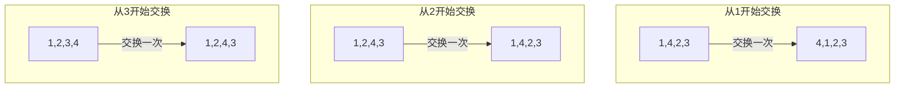

### 循环左移数组算法解读

#### 问题描述
设目标数组为arr,其长度是length，现对其进行循环左移count个元素。例如：{1,2,3,4} 循环左移2个后，结果为：{3,4,1,2}。

#### 算法分析
在对数组进行左移前后元素进行对照可以发现，如果，第一个元素的目标地址确定，则第2,第3等后面元素的地址也可以确定。例如：{1,2,3,4,5}是原数组，左移数是3，则结果数组是{4,5,1,2,3}。其中，第一个元素的目标地址是2，在结果数组中后面还有两个空位，并且被原数组中第二与第三的元素占用，由此可以想到，如果在结果数组中第一元素后有n个位置，则必定被原数组中第2至第n+1的元素占用。因此它们的目标地址便求出来了。  
现在，我们只需知道第一个元素的目标地址targetindex与其后面的位置数remaining，便可求出第2至第remaining+1个元素的目标地址。现在考虑能否直接将这些元素移动到对应的位置上去？答案是肯定的。 当从第remaining+1个元素向后逐个交换便可达到目的。例如：原数组{1,2,3,4}，左移数3:

同时，可以发现这个算法的时间复杂度是$(count-1) * (length-count-2)$
1. 计算出原数组中第一个元素的转化下标targetindex。
2. 再求出除第一个元素外还有多少个元素需要移位remaining = (length - 1) -targetindex。
3. 此时，便可以把arr分成两部分：
    - 第一部分：索引0至索引remaining，记为LeftPart。
    - 第二部分：索引remaining+1至length-1，记为RightPart。
4. 从LeftPart中的最后一个元素开始逐个向前遍历，每遍历一个元素则执行向后两两交换，直到交换到目的地为止。
